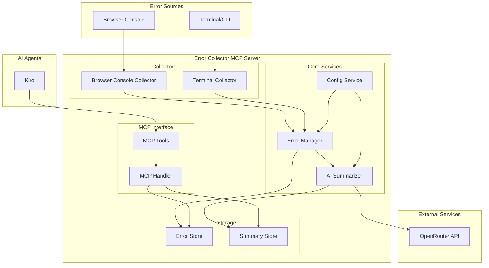

# Design Document

## Overview

The Error Collector MCP is a Python-based Model Context Protocol server that provides intelligent error collection and summarization capabilities. The system consists of multiple collectors (browser console, terminal), an AI-powered summarization engine using OpenRouter, and MCP tools for integration with AI agents like Kiro.

The architecture follows a modular design with clear separation between error collection, processing, storage, and API exposure through MCP tools.

## Architecture



## Components and Interfaces

### Error Collectors

#### Browser Console Collector
- **Purpose**: Captures JavaScript errors, console errors, and unhandled promise rejections
- **Implementation**: Browser extension or injected script that listens to console events
- **Interface**: 
  ```python
  class BrowserConsoleCollector:
      def start_collection(self) -> None
      def stop_collection(self) -> None
      def get_collected_errors(self) -> List[BrowserError]
  ```

#### Terminal Collector  
- **Purpose**: Monitors terminal sessions for command failures and compilation errors
- **Implementation**: Process wrapper or shell integration that captures stderr and exit codes
- **Interface**:
  ```python
  class TerminalCollector:
      def monitor_command(self, command: str) -> CommandResult
      def start_monitoring(self) -> None
      def get_recent_errors(self) -> List[TerminalError]
  ```

### Core Services

#### Error Manager
- **Purpose**: Central coordinator for error collection, deduplication, and routing
- **Responsibilities**: 
  - Aggregate errors from multiple collectors
  - Deduplicate similar errors
  - Trigger AI summarization
  - Manage error lifecycle
- **Interface**:
  ```python
  class ErrorManager:
      def register_error(self, error: BaseError) -> str
      def get_errors(self, filters: ErrorFilters) -> List[BaseError]
      def request_summary(self, error_ids: List[str]) -> str
  ```

#### AI Summarizer
- **Purpose**: Generate intelligent summaries using OpenRouter's free models
- **Implementation**: Async service with rate limiting and retry logic
- **Interface**:
  ```python
  class AISummarizer:
      def summarize_error(self, error: BaseError) -> ErrorSummary
      def summarize_error_group(self, errors: List[BaseError]) -> ErrorSummary
      def get_solution_suggestions(self, summary: ErrorSummary) -> List[str]
  ```

#### Config Service
- **Purpose**: Manage server configuration and user preferences
- **Interface**:
  ```python
  class ConfigService:
      def load_config(self, config_path: str) -> Config
      def get_openrouter_config(self) -> OpenRouterConfig
      def get_collection_preferences(self) -> CollectionPreferences
  ```

### MCP Tools

#### Error Query Tool
- **Purpose**: Allow AI agents to query collected errors
- **Parameters**: time_range, error_type, source, limit
- **Returns**: Structured error data with summaries

#### Error Summary Tool  
- **Purpose**: Get AI-generated summaries for specific errors
- **Parameters**: error_ids, group_similar
- **Returns**: Comprehensive error analysis with solutions

#### Error Statistics Tool
- **Purpose**: Provide error trends and statistics
- **Parameters**: time_range, grouping
- **Returns**: Error frequency, types, and patterns

## Data Models

### Base Error Model
```python
@dataclass
class BaseError:
    id: str
    timestamp: datetime
    source: ErrorSource
    message: str
    stack_trace: Optional[str]
    context: Dict[str, Any]
    severity: ErrorSeverity
    category: ErrorCategory
```

### Browser Error Model
```python
@dataclass
class BrowserError(BaseError):
    url: str
    user_agent: str
    page_title: str
    line_number: Optional[int]
    column_number: Optional[int]
    error_type: str  # TypeError, ReferenceError, etc.
```

### Terminal Error Model
```python
@dataclass
class TerminalError(BaseError):
    command: str
    exit_code: int
    working_directory: str
    environment: Dict[str, str]
    stderr_output: str
    stdout_output: str
```

### Error Summary Model
```python
@dataclass
class ErrorSummary:
    error_ids: List[str]
    root_cause: str
    impact_assessment: str
    suggested_solutions: List[str]
    related_errors: List[str]
    confidence_score: float
    generated_at: datetime
```

## Error Handling

### Collection Errors
- **Browser Access Issues**: Graceful degradation when browser extension cannot be installed
- **Terminal Permission Issues**: Clear error messages and fallback to manual error reporting
- **Network Connectivity**: Queue errors locally when OpenRouter API is unavailable

### API Integration Errors
- **Rate Limiting**: Implement exponential backoff with jitter
- **Authentication Failures**: Clear configuration guidance and error messages
- **Model Unavailability**: Fallback to alternative free models or basic summarization

### Data Persistence Errors
- **Storage Failures**: Implement backup storage mechanisms
- **Corruption Recovery**: Data validation and repair utilities
- **Migration Issues**: Version-aware data schema handling

## Testing Strategy

### Unit Testing
- **Collectors**: Mock error sources and verify collection accuracy
- **AI Summarizer**: Test with known error patterns and validate summary quality
- **MCP Tools**: Verify tool responses match expected schemas
- **Data Models**: Validate serialization/deserialization and data integrity

### Integration Testing
- **End-to-End Error Flow**: Simulate errors from collection to MCP tool response
- **OpenRouter Integration**: Test API calls with various error types and edge cases
- **Configuration Loading**: Test various config scenarios and error conditions

### Performance Testing
- **Error Collection Volume**: Test with high-frequency error scenarios
- **AI Summarization Latency**: Measure response times and optimize bottlenecks
- **Memory Usage**: Monitor memory consumption during extended operation

### Security Testing
- **Data Privacy**: Verify no sensitive data leaks to external services
- **API Key Security**: Test secure storage and transmission of credentials
- **Input Validation**: Test with malicious or malformed error data

## Implementation Considerations

### Browser Integration Options
1. **Browser Extension**: Most comprehensive but requires user installation
2. **Bookmarklet**: Easy deployment but limited functionality  
3. **Development Server Proxy**: Automatic for local development but limited scope

### Terminal Monitoring Approaches
1. **Shell Wrapper**: Intercept commands through custom shell functions
2. **Process Monitor**: System-level monitoring of process exits
3. **Log File Parsing**: Monitor common log locations for error patterns

### OpenRouter Integration
- Use free tier models (e.g., Meta Llama 3.1 8B Instruct Free)
- Implement smart batching to minimize API calls
- Cache summaries to avoid redundant processing
- Provide offline mode for privacy-conscious users